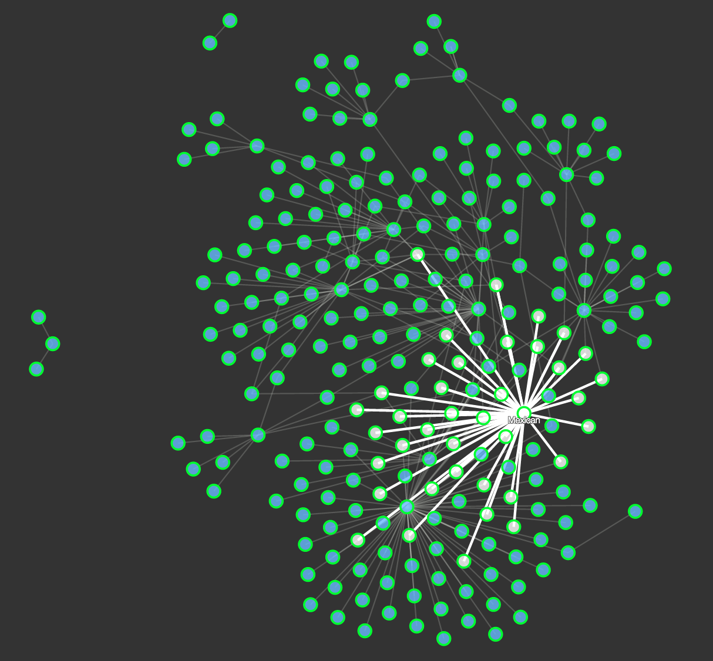

## Automated Topic Detection and Social Recommendation using LDA
### Vinay Mandal
#### 2015-09-01


--- .class #id 

## Motivation
1. Most recommendation don't use review texts
2. Real World data
3. Graphs

---

## The dataset

Number of Businesses: <span style="color:green; font-weight:bold">61184</span>
<br>
Number of Users: <span style="color:green; font-weight:bold">366715</span>
<br>
Number of Reviews: <span style="color:green; font-weight:bold">1569264</span>

---

## Method Overview
1. Uncover hidden dimensions of ratings and review text combined
2. Use the hidden dimensions from review texts to find user preference
3. Build a graph database of user - prefers - latent topic
4. Use the graph to recommend new friends

---

## Training
<span style="font-weight:bold; font-size:40pt";>Tokenize Reviews<span>
<span style="color:green; font-weight:bold; font-size:40pt";> &#8594;</span>
<span style="font-weight:bold; font-size:40pt";>Remove stop words<span>
<span style="color:green; font-weight:bold; font-size:40pt";> &#8594;</span>
<span style="font-weight:bold; font-size:40pt";>POS Tagging</span>
<span style="color:green; font-weight:bold; font-size:40pt";> &#8594;</span>
<span style="font-weight:bold; font-size:40pt";>Lemmatize<span>
<span style="color:green; font-weight:bold; font-size:40pt";> &#8594;</span>
<span style="font-weight:bold; font-size:40pt";>Train LDA</span>
<span style="color:green; font-weight:bold; font-size:40pt";> &#8594;</span>
<span style="font-weight:bold; font-size:40pt";>Label latent topics</span>

--- &vertical

## Tokenization and removal of stop words

1. Process of breaking stream of text into words, symbols, phrases or other meaningful elements called tokens.
2. Certain characters like punctuations might be excluded
<br>
An example: "Few things are harder to put up with than a good example."
<br>
can be tokenized into:
<br> ["few", "things", "are", "harder", "to", "put", "up", "with", "than", "a", "good", "example"]
3. Stop words like are, to, up and a can be ignored as they are not important

--- &vertical

## POS Tagging

Process of classifying words into their parts of speech based on its definition as well as its context.

[('Few', 'JJ'), ('things', 'NNS'), ('harder', 'JJR'), ('put', 'VB'), ('up', 'RP'), ('than', 'IN'), ('good', 'JJ'), ('example', 'NN')]

--- 

## Lemmatization
"Process of grouping diffrent inflected forms of word so that they can be analyzed as single word"

```
wordnet_lemmatizer.lemmatize(‘aardwolves’) # u'aardwolf'
wordnet_lemmatizer.lemmatize(‘is’, pos=’v’) # u'be'
wordnet_lemmatizer.lemmatize(‘are’, pos=’v’) # u'be

---

## Latent Dirichlet Allocation
"...is a generative model that allows sets of observations to be explained by unobserved groups that explain why some parts of the data are similar." 
<br>
- In LDA, a document is a mixture of a small number of topics and that each word's creation is attributable to one of the document's topics 
- LDA is similar to LSA except in LDA topic distribution is assumed to have Dirichlet prior.
- Using python package "gensim"

---

## Model prediction example

<span style="color:#EAB9B9">"I love this place and eat here at least once a week. Their pad si yew, pad Thai, dumplings, Siam rolls, and their curries are their best dishes. Especially the curry. You can't go wrong at Thai moon, so I suggest you go and enjoy the food!"</span>
<br><br>
Model prediction: 
<br><span style="color:green">['scores': u'0.060*thai + 0.036*food + 0.032*curry + 0.028*lunch + 0.027*spicy + 0.023*place + 0.021*tea + 0.019*dish + 0.017*chicken + 0.015*time']</span>

---

## User &#8594; Likes &#8594; Topic
### Why graph db?
1. Relationships are first-class citizens of graph database
2. High performance online query
3. Good for building recommendation engine

---

## User &#8594; Likes &#8594; Topic
Neo4j with "py2neo". Example:
```
from py2neo import Node, Relationship, Graph
graph = Graph()
userNode = Node('User', name='name', id=jsonData'user_id')
topicNode = Node('topics', 'key', topicKey)
likes = Relationship(userNode, 'topiclike', topicNode)
graph.create(likes)
```

---

## User &#8594; Likes &#8594; Topic


---

## Recommendation Engine
```
query = ('match (u1 {id:"UZyNf0h26jNVvpHT-GF2oA"})'
         ' - [rel:topiclike]-> r <- [re:topiclike] - (u2) '
         'with count(r) as topiccounts, u2 as user2 '
         'where topiccounts > 2 return user2, topiccounts'
         ' order by topiccounts desc limit 10')
result = graph.cypher.execute(query)
```

---
## Result

        | userid                 | topiccounts
----|------------------------|-------------
  1 | kGgAARL2UmvCcTRfiscjug |          20
  2 | 4ozupHULqGyO42s3zNUzOQ |          19
  3 | DrWLhrK8WMZf7Jb-Oqc7ww |          16
  4 | 90a6z--_CUrl84aCzZyPsg |          15
  5 | 4G68oLRY3aHE5XUt_MUUcA |          12
  6 | iwUN95LIaEr75TZE_JC6bg |          11
  7 | pEVf8GRshP9HUkSpizc9LA |          10
  8 | Ovpa3S8xD96dLE5eDxcxJg |          10
  9 | WmAyExqSWoiYZ5XEqpk_Uw |           9
 10 | lmiDCrmas8TxRsbIGZX9Pg |           9
 
## -

---

## Future Work

1. Find trendsetters
2. Location aware recommendation
3. Predict usefulness of review texts
